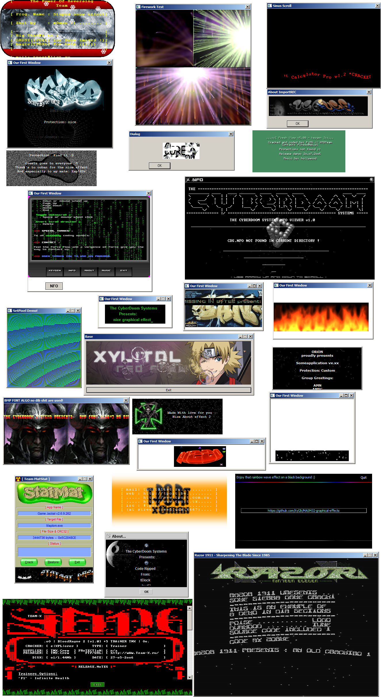

MASM32 graphical effects code collection
=========
Various graphical effects from the warez scene.
This collection is mixed with original code and ripped code.<br />
Credits goes to the autors.<br />
Each effect contain a [WinASM](https://www.winasm.org/) project file, and codes can be compiled also from their respective ```make.bat``` if you don't want to launch your favorite IDE.<br />
<br />
Preview of not of everything but a good part of this code collection:

<br />
See also my [MASM32 Code collection for reverse engineers](https://github.com/Xyl2k/Xylitol-MASM32-snippets).